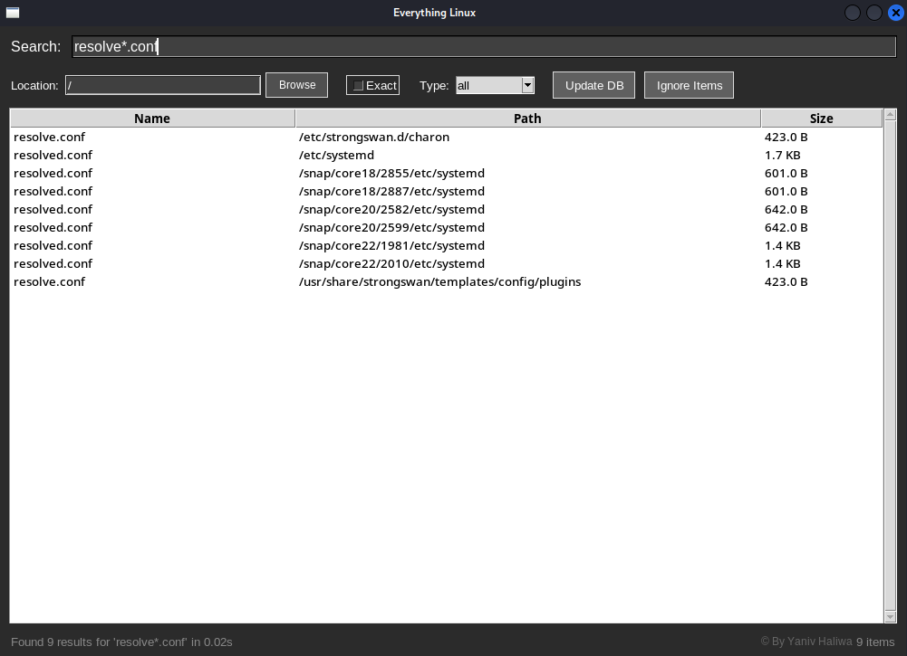
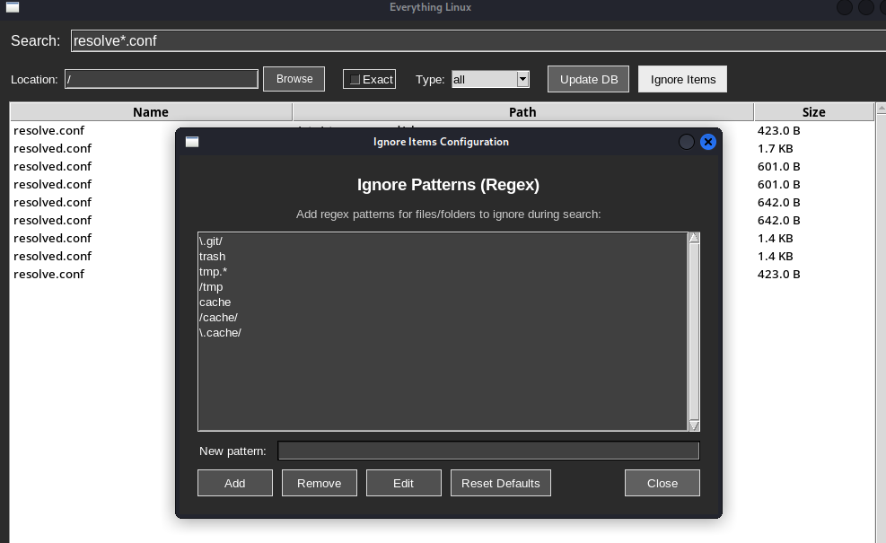

# Everything Linux

A fast, responsive file search application for Linux that brings the instant search experience to Linux systems. Built with Python and Tkinter, it uses `plocate` for lightning-fast file indexing and searching across your entire Linux filesystem.

## 💡 Inspiration

This project was inspired by the incredible **[Everything](https://www.voidtools.com/support/everything/)** search tool for Windows, created by David Carpenter (voidtools). Everything for Windows revolutionized file searching with its instant, real-time search capabilities that could find any file on your system in milliseconds.

As a Linux user who missed having such a powerful and responsive search tool, this project aims to bring that same lightning-fast search experience to Linux systems. While Linux has always had powerful command-line tools like `find` and `locate`, there was a need for a modern GUI application that could provide the same instant gratification that Windows Everything users enjoy.

**Everything Linux** leverages the power of `plocate` (the modern successor to `locate`) combined with a responsive Python GUI to deliver that instant search experience Linux users deserve.


## 📸 Screenshots

### Main Interface

The application features a modern dark theme with an intuitive layout:

- Real-time search with instant results
- File type filtering (All/File/Folder)
- Location-based search with browse functionality
- Configurable ignore patterns
- Status bar with result counts and copyright notice



### Ignore Patterns Configuration

Advanced ignore pattern management with regex support:

- Add/remove custom ignore patterns
- Edit existing patterns
- Reset to default patterns
- Real-time pattern validation



### Search Examples

- **Wildcard Search**: `*.py` finds all Python files
- **Exact Match**: Search for "config" finds files with exact word matching
- **File-only Search**: When Type="file", searches match only filenames, not paths

## 🚀 Features

### Core Search Capabilities

- **Real-time Search**: Type and see results instantly with smart debouncing
- **Multiple Search Modes**:
  - **Exact Match**: Find files with exact word matching
  - **Wildcard Search**: Use `*` and `?` for pattern matching
  - **Substring Search**: Find files containing your search term
- **File Type Filtering**: Search specifically for files, folders, or both
- **Location-based Search**: Restrict searches to specific directories
- **Case-insensitive**: All searches are case-insensitive by default

### Advanced Features

- **Smart Ignore Patterns**: Configurable regex patterns to exclude unwanted results
- **File Size Display**: Shows file sizes in human-readable format
- **Double-click to Open**: Open files directly from search results
- **Database Updates**: Built-in GUI for updating the search database
- **Dark Theme**: Modern dark interface for comfortable use
- **Threading**: Non-blocking searches that don't freeze the UI
- **Search Cancellation**: Cancel long-running searches instantly

### User Interface

- **Responsive Design**: Large, resizable window (1000x700)
- **Status Bar**: Real-time search status and result counts
- **Progress Indicators**: Visual feedback during searches and database updates
- **Keyboard Shortcuts**:
  - `Enter`: Open selected file
  - `Escape`: Clear search and reset filters

## 📋 Requirements

### System Requirements

- **Operating System**: Linux (any distribution)
- **Python**: 3.6 or higher
- **Display**: X11 or Wayland desktop environment

### Dependencies

- **plocate**: Fast file indexing and searching
- **Python Tkinter**: GUI framework (usually pre-installed)
- **Python Standard Library**: threading, subprocess, pathlib, re, os, time

## 🔧 Installation

### 1. Install plocate

```bash
# Ubuntu/Debian
sudo apt update
sudo apt install plocate

# Fedora/RHEL/CentOS
sudo dnf install plocate

# Arch Linux
sudo pacman -S plocate

# openSUSE
sudo zypper install plocate
```

### 2. Clone the Repository

```bash
git clone https://github.com/YanivHaliwa/everything-linux.git
cd everything-linux
```

### 3. Make Executable

```bash
chmod +x everything-linux
```

### 4. Initial Database Setup

```bash
# Update the plocate database (required for first use)
sudo updatedb
```

## 🚀 Usage

### Basic Usage

```bash
# Run the application
python3 everything-linux

# Or if made executable
./everything-linux
```

### Search Examples

#### Exact Search

- Search for "config" - finds files with the exact word "config"
- Perfect for finding configuration files and potential misconfigurations

#### Wildcard Search

- `*.py` - finds all Python scripts (great for finding exploit scripts)
- `*flag*` - quickly locate flag files during CTF challenges
- `*payload*` - find all payload files for penetration testing
- `*.conf` - locate configuration files that might contain credentials
- `*exploit*` - find exploitation scripts and tools
- `*.log` - search for log files during forensic analysis
- `*wordlist*` - locate password and subdomain wordlists
- `*.pcap` - find network capture files for analysis

#### Cybersecurity-Specific Examples

- `*password*` - find files that might contain credentials
- `*secret*` - locate files with potential sensitive information
- `*.key` - find SSH keys, GPG keys, and other cryptographic materials
- `*backup*` - discover backup files that might contain sensitive data
- `*admin*` - locate administrative tools and configurations

#### File Type Filtering

- Set **Type** to "file" and search for "*.conf" to find only configuration files
- Set **Type** to "folder" and search for "home" to find directories

#### Location-based Search

- Set **Location** to "/home/user" to search only in your home directory
- Use the Browse button to select specific directories

### Advanced Configuration

#### Ignore Patterns

Click **"Ignore Items"** to configure patterns for files/folders to exclude:

- `\.git/` - Ignore Git repositories
- `node_modules` - Ignore Node.js dependencies
- `__pycache__` - Ignore Python cache files
- `\.cache/` - Ignore cache directories

#### Database Updates

- Click **"Update DB"** to refresh the file index
- Automatic GUI sudo prompt for administrative privileges
- Background processing to avoid UI freezing

## 🎯 Search Logic & Performance

### How It Works

1. **Real-time Input**: 300ms debounce prevents excessive searches
2. **plocate Integration**: Leverages the system's indexed file database
3. **Smart Filtering**: Post-processes results for exact filename matching
4. **Threading**: All searches run in background threads
5. **Cancellation**: Previous searches are cancelled when new ones start

### Performance Optimizations

- **Early Type Filtering**: File/folder filtering happens before expensive operations
- **Efficient Regex**: Optimized pattern matching for wildcards
- **Memory Management**: Results are processed in streams, not loaded entirely in memory
- **Smart Caching**: plocate uses system-level caching for repeated searches

### Search Accuracy

- **Filename-only Matching**: When Type="file", searches match only the filename, not the full path
- **Path-aware Filtering**: Location filtering works with full paths
- **Ignore Pattern Priority**: Ignore patterns are applied before other filters

## 🔧 Configuration

### Default Ignore Patterns

```regex
\.git/          # Git repositories
trash           # Trash directories
tmp.*           # Temporary files/directories
/tmp            # System temp directory
cache           # Cache directories
/cache/         # System cache paths
\.cache/        # User cache directories
```

### Customization

- **Window Size**: Modify `geometry("1000x700")` in the code
- **Search Delay**: Adjust `search_delay = 0.03` for different responsiveness
- **Debounce Time**: Change `300` in `self.root.after(300, ...)` for different delays

## 📊 Performance Benchmarks

### Typical Performance

- **Database Size**: ~1M files indexed in <100MB
- **Search Speed**: Results in <200ms for most queries
- **Memory Usage**: ~50-100MB during normal operation
- **Startup Time**: <2 seconds on modern systems

### Scalability

- Tested with filesystems containing 10M+ files
- Efficient handling of large result sets (10k+ matches)
- Graceful timeout handling for extremely broad searches

## 🏗️ Architecture

### Core Components

```
everything-linux.py
├── EverythingLinux (Main Class)
│   ├── GUI Setup (Tkinter Interface)
│   ├── Search Engine (plocate Integration)
│   ├── Filter System (Smart Result Filtering)
│   ├── Threading Manager (Non-blocking Operations)
│   └── Configuration Manager (Ignore Patterns)
```

### Design Patterns

- **Observer Pattern**: GUI elements respond to search state changes
- **Thread Pool**: Background search operations
- **Strategy Pattern**: Different search modes (exact, wildcard, substring)
- **Command Pattern**: GUI actions encapsulated as commands

### Data Flow

1. **User Input** → Debounced search trigger
2. **plocate Query** → System file database search
3. **Result Filtering** → Apply type, location, and ignore filters
4. **UI Update** → Display results in threaded manner

## 🛠️ Troubleshooting

### Common Issues

#### "plocate not found" Error

```bash
# Install plocate
sudo apt install plocate  # Ubuntu/Debian
sudo dnf install plocate  # Fedora
```

#### No Search Results

```bash
# Update the database
sudo updatedb
```

#### Permission Errors

- Ensure your user has read access to directories you're searching
- Some system directories may be restricted

#### Slow Searches

- Update the plocate database: `sudo updatedb`
- Reduce search scope by specifying a location
- Use more specific search terms

### Debug Mode

Enable debug output by setting `DEBUG = True` at the top of the file for detailed logging.

### System Compatibility

- **Tested Distributions**: Ubuntu 20.04+, Debian 11+, Fedora 35+, Arch Linux, openSUSE
- **Desktop Environments**: GNOME, KDE, XFCE, i3, and others
- **Python Versions**: 3.6, 3.7, 3.8, 3.9, 3.10, 3.11+

## 🔒 Security Considerations

### File Access

- Application respects system file permissions
- No elevation of privileges during normal operation
- Database updates require sudo (standard plocate behavior)

### Privacy

- No data collection or external communication
- All operations are local to your system
- Search history is not stored

### Safe Patterns

- Ignore patterns use regex sandboxing
- Input validation prevents command injection
- Timeout mechanisms prevent resource exhaustion

## 🤝 Contributing

Contributions are welcome! Please feel free to submit a Pull Request. For major changes, please open an issue first to discuss what you would like to change.

### Development Setup

1. Fork the repository
2. Create a feature branch (`git checkout -b feature/AmazingFeature`)
3. Commit your changes (`git commit -m 'Add some AmazingFeature'`)
4. Push to the branch (`git push origin feature/AmazingFeature`)
5. Open a Pull Request

### Code Standards

- Follow PEP 8 Python style guidelines
- Include comprehensive error handling
- Add comments for complex logic sections
- Maintain the DEBUG flag pattern for debugging
- Update version date in the format `#version DD.MM.YY`

### Testing Guidelines

- Test on multiple Linux distributions
- Verify compatibility with different Python versions
- Test with various file system sizes
- Validate ignore pattern functionality

## 🎯 Roadmap

### Planned Features

- [ ] **File Preview**: Quick preview of text files in results
- [ ] **Search History**: Remember recent searches
- [ ] **Custom Themes**: Light theme and custom color schemes
- [ ] **Plugin System**: Extensible search filters and actions
- [ ] **Network Search**: Search across networked filesystems
- [ ] **Advanced Filters**: Date, size, and permission-based filtering

### Performance Improvements

- [ ] **Result Caching**: Cache frequent search results
- [ ] **Incremental Search**: Update results as database changes
- [ ] **Parallel Processing**: Multi-threaded result processing
- [ ] **Memory Optimization**: Reduce memory footprint for large results

### User Experience

- [ ] **Keyboard Navigation**: Full keyboard control
- [ ] **Search Suggestions**: Auto-complete based on filesystem
- [ ] **Bookmarks**: Save frequently accessed locations
- [ ] **Export Results**: Save search results to files

## 📝 License

This project is licensed under the MIT License - see the [LICENSE](LICENSE) file for details.

## 🔗 Related Projects

- **plocate**: The fast file locating system this tool depends on
- **Everything**: The Windows equivalent that inspired this project
- **locate/mlocate**: Traditional Linux file location tools

## ⚡ Why Everything Linux?

### Advantages over Traditional Tools

- **GUI Interface**: More user-friendly than command-line `find` or `locate`
- **Real-time Results**: See results as you type, no need to press Enter
- **Smart Filtering**: Advanced file type and location filtering
- **Cross-session**: Persistent ignore patterns and preferences

### When to Use

- **Cybersecurity**: CTF challenges, penetration testing, digital forensics, malware analysis, security research, red/blue team operations, bug bounty hunting, IOC searches, and system administration security tasks
- **General Users**: Replace traditional file browsing when you know the filename but not the location, quickly find documents, media files, or any content across your system

### Bug Reports

When reporting bugs, please include:

- Operating system and version
- Python version (`python3 --version`)
- plocate version (`plocate --version`)
- Steps to reproduce the issue
- Expected vs actual behavior
- Debug output (if applicable)

### Feature Requests

We welcome feature suggestions! Please provide:

- Clear description of the proposed feature
- Use case and benefits
- Implementation suggestions (if any)

## Author

Created by [Yaniv Haliwa](https://github.com/YanivHaliwa) for security testing and educational purposes.
